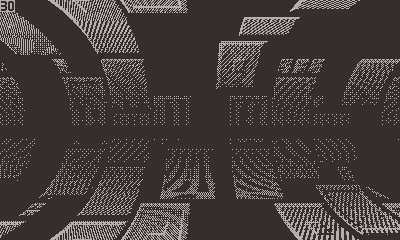

# Barrel
## A tech demo ported to the PlayDate

A [PlayDate] version of Super Castlevania IV's barrel effect found in 4-3.

It was made public but it's not tested yet on a real device to see how fast it'd run.
I don't expect a solid 30 FPS out of it, but it shouldn't run at 2 FPS either.

## Core concept

The barrel effect is done on a SNES by altering the Mode 7 layer's affine
matrix line per line with the help of the hardware DMA and H-Blank interrupts.

By scaling and offseting the layer horizontally every line with a factor fluctuating like a sine over the screen,
a plausbile effect can be easily done after tweaking the values to your tastes. Super Castlevania hardcoded the sine
effect but in this demo this hasn't been done yet as it's probably already fitting the 30fps target.

## Additional Notes
- If undocked, the horizontal offset is based on the crank's angle. Make it move by moving the crank!
- More info on Castlevania's tunnel trick in [this][retro game mechanics] by Retro Game Mechanics Explained.
- Actually, tunnel effect is a better name but it's too late, oops.
- The gradient is currently overlayed over the effect itself, it could be prepared on a per-line basis or fully disabled
  if it moirés too much.

[PlayDate]: https://play.date
[Sphere]: https://www.lexaloffle.com/bbs/?tid=30467
[Heiko Behrens]: https://twitter.com/HBehrens
[retro game mechanics]: https://www.youtube.com/watch?v=pafOj9IrtuY